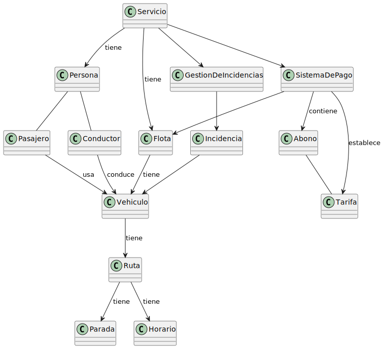
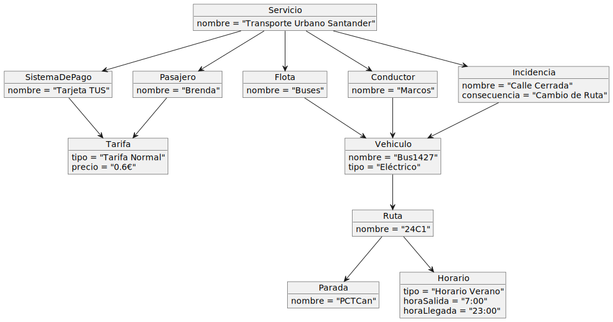
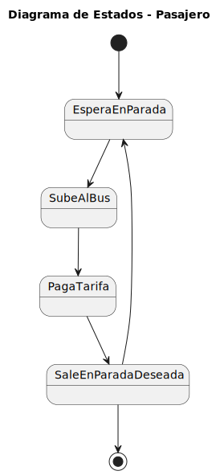
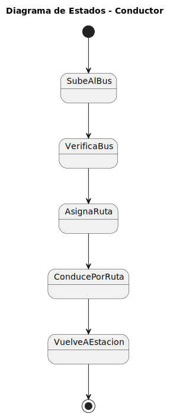
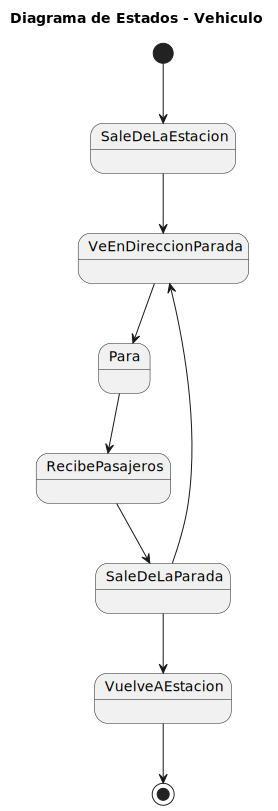

# Sistema de Transporte Público - Modelo de Dominio

## Descripción del Sistema

El sistema combina los elementos necesarios para gestionar pasajeros, conductores, vehículos, rutas, horarios, tarifas y el manejo de incidencias. Se centra en la interacción entre estos componentes para ofrecer un servicio funcional y seguro.

- **Servicio:** Es el componente central que coordina todos los elementos clave, como las personas involucradas (pasajeros y conductores), la flota de vehículos, el sistema de pago y la gestión de incidencias.

- **Persona:** Representa a las personas dentro del sistema, dividiéndose en dos roles principales:

    - **Pasajero:** Usa los vehículos y paga por el servicio.

    - **Conductor:** Opera los vehículos asignados.

- **Flota:** Es el conjunto de vehículos que presta el servicio, cada uno asignado a una ruta específica.

- **Ruta:** Representa el recorrido que siguen los vehículos, incluyendo sus paradas y horarios.

- **Sistema de Pago:** Se encarga de la gestión de tarifas y abonos para los pasajeros, asegurando un mecanismo eficiente para acceder al servicio.

- **Tarifa:** Define el costo del servicio que los pasajeros deben pagar. Puede variar según diferentes criterios, como el tipo de tarifa (normal, reducida, etc.).

- **Abono:** Representa un tipo de pago que permite a los pasajeros utilizar el servicio de manera continua durante un periodo determinado, como un abono mensual.

- **Vehículo:** Son los medios de transporte que forman parte de la flota, cada uno con características específicas (por ejemplo, buses eléctricos, híbridos, etc.). Los vehículos se asignan a rutas y son conducidos por los conductores.

- **Parada:** Son los puntos a lo largo de una ruta donde los vehículos realizan paradas para recoger o dejar pasajeros.

- **Horario:** Define las horas de salida y llegada de los vehículos en cada ruta, pudiendo estar sujetos a variaciones, como horarios de verano.

- **GestionDeIncidencias:** Este componente gestiona los problemas y situaciones imprevistas que pueden surgir durante la operación del servicio, como accidentes o condiciones adversas. La gestión de incidencias afecta a la planificación de las rutas y la disponibilidad de los vehículos.

- **Incidencia:** Representa los eventos o situaciones imprevistas que afectan el servicio, como una "Calle Cerrada", lo que obliga a modificar la ruta habitual de un vehículo.

## 1. Fotos Originales del Examen

Aquí se presentan las fotos de las hojas originales del examen en las que se diseñó el modelo de dominio. [Ver examen](images/ExamenParcial/README.md) |

---

## 2. Diagramas Originales 

| Diagrama | Código PlantUML |
|----------|------------------|
|  | [Ver código](modelosUML/DdC_Original.puml) |
|  | [Ver código](modelosUML/DdO_Original.puml) |
|  | [Ver código](modelosUML/DdE_Pasajero_Original.puml) |
|  | [Ver código](modelosUML/DdE_Conductor_Original.puml) |
|  | [Ver código](modelosUML/DdE_Vehiculo_Original.puml) 

---

## 3. Diagramas Iterados y Mejorados

Después de trasladar el modelo inicial a PlantUML, se realizaron mejoras y optimizaciones. Estos diagramas SVG reflejan la **Iteración 3**, con una estructura de relaciones más refinada y elementos adicionales que amplían la funcionalidad del modelo.

| Diagrama Mejorado | Código PlantUML |
|--------------------|------------------|

---

